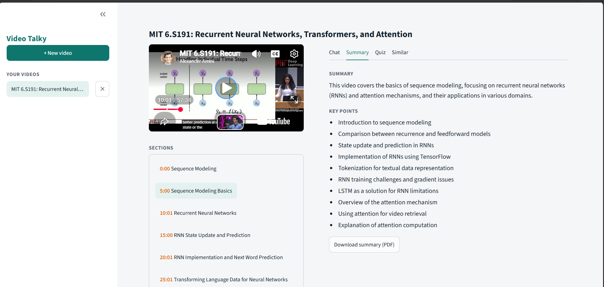

# 🚀 [Tips Hindawi](https://www.tipshindawi.com/) Internship (August–October) 2026

> 🎓 This project was built during the [ **Tips Hindawi** ](https://www.tipshindawi.com/) **Internship (August–October) 2026**.

## 👤 Participant

| Field            | Value                                          |
| ---------------- | ---------------------------------------------- |
| Full Name        | Mariam Ebrahim Mahfouz Mohammed                |
| Project Name     | VideoTalky: Chat, Summarize and Quiz YouTube Videos |
| GitHub Username  | Mariam-Ebrahim                                 |
| Internship Batch | August–October 2026                            |
| Training Program | Large Language Models (LLMs) Program           |
| Organization     | [**Edrak for Ai**](https://edrak4ai.com/en)    |

---

# 📖 Project Overview

**VidTalk** turns a YouTube video into something you can talk to. Paste a link and the app builds a searchable copy of the video, then lets you **chat with it**, read a **sectioned summary**, take a **quiz**, and find **similar videos**. It works with **Arabic and English** videos.

Every answer points back to a time in the video, so you can check it. If the question is not covered in the video, the app says so instead of guessing.

How it works:

```
YouTube link
   │
   ├─ captions found ──────────► transcript (with timestamps)
   └─ no captions ─► download audio ─► Whisper (Kaggle GPU) ─► transcript
                                                │
              chunks ─► multilingual embeddings ─► FAISS index   (RAG for chat)
                                                │
              sections ─► summary + key points ─► quiz            (LLM on Kaggle GPU)
```

The interface runs on **your computer**. The big models (the LLM and Whisper) run on a **free Kaggle GPU** and are reached through an **ngrok** link.

---

# ✨ Features

* **Chat with the video:** answers use only the video's content and show clickable timestamps
* **Sections:** the video is split into titled parts you can jump to
* **Summary and key points**, built part by part so long videos work
* **Quiz:** 10 multiple-choice questions spread over the video, with a score, explanations, and a link to the moment that explains each answer. "Another quiz" option
* **Similar videos:** finds related videos on YouTube
* **Videos without captions:** the audio is transcribed with Whisper on the Kaggle GPU
* **PDF download** of the summary and of the quiz, including Arabic text
* **Several videos at once:** each video keeps its own chat, summary and quiz in the sidebar
* Quiz questions and sections are written **in batches** on the GPU, which makes them much faster than one by one

---

# 🛠️ Technologies Used

* **Python**, **Streamlit** (interface)
* **youtube-transcript-api** and **yt-dlp** (captions, audio download, similar videos)
* **sentence-transformers** (`paraphrase-multilingual-MiniLM-L12-v2`, understands Arabic and English) and **FAISS** (search)
* **LangChain** (`StructuredOutputParser` to check the model's JSON)
* **Hugging Face Transformers**: `Qwen/Qwen2.5-7B-Instruct` loaded in 4-bit, and `openai/whisper-medium`
* **FastAPI** + **ngrok**: serve the models from a Kaggle GPU notebook
* **fpdf2** (PDF files)

---

# ⚙️ Installation: run it on your own computer

You need about **30 minutes** the first time. Everything is free.

### What you need first

| Tool | Why | Link |
| --- | --- | --- |
| Python 3.10 or newer | runs the app | https://www.python.org/downloads/ |
| Git | downloads the code | https://git-scm.com/downloads |
| A Kaggle account | free GPU for the models. It may ask for phone verification to turn on GPU and Internet | https://www.kaggle.com/ |
| An ngrok account | gives the Kaggle server a public link | https://ngrok.com/ |

### Step 1. Get the code

```bash
git clone https://github.com/Mariam-Ebrahim/Video_Talky.git
cd Video_Talky
python -m venv .venv
.venv\Scripts\activate            # Mac/Linux: source .venv/bin/activate
pip install -r requirements.txt
```

The first run downloads the search model (about 500 MB), so it can take a few minutes.

### Step 2. Add a font for the PDF files

PDFs need a font that has Arabic letters. Download **DejaVuSans.ttf** from https://dejavu-fonts.github.io/ and put it here:

```
Video_Talky/fonts/DejaVuSans.ttf
```

(The app works without it, but the PDF buttons will show a short message instead of a file.)

### Step 3. Start the model server on Kaggle

1. Go to Kaggle → **Create → New Notebook**.
2. In the notebook settings, choose **GPU (T4 ×2 or P100)** and turn **Internet on**.
3. Open **Add-ons → Secrets** and add two secrets:
   * `NGROK_TOKEN`: your authtoken from the ngrok dashboard (*Getting Started → Your Authtoken*)
   * `API_KEY`: any long password you invent. Keep it, you need it again in Step 4
4. Create three cells and run them one after another:

```python
!pip install -q transformers accelerate bitsandbytes fastapi uvicorn pyngrok python-multipart
```
```python
%%writefile llm_server.py
# paste the full content of core/llm_server.py here
```
```python
!python llm_server.py
```

5. Wait for the model to load (a few minutes), until you see:

```
PUBLIC URL: https://xxxx.ngrok-free.app
```

6. **Copy that URL and keep the last cell running.** If you stop it or the session ends, the app stops answering. Every restart gives a **new URL**.

### Step 4. Connect the app to the server

Copy `.env.example` to `.env` and fill in the two values:

```
LLM_URL=https://xxxx.ngrok-free.app
LLM_TOKEN=the-same-API_KEY-from-Kaggle-Secrets
```

Check the server: open `https://xxxx.ngrok-free.app/health` in your browser. You should see `{"status":"ok", ...}`.

### Step 5. Run the app

```bash
streamlit run app.py
```

Open http://localhost:8501.

---

# 🚀 Usage

1. Paste a YouTube link on the home page and press the button. Videos with captions are ready in about a minute or two. Videos without captions take longer, because the audio is transcribed first.
2. **Chat:** ask a question. The answer shows time buttons that jump the video to the right moment.
3. **Summary:** read the summary and key points, or download them as a PDF.
4. **Quiz:** press **Start quiz**, answer, submit, and review your score with explanations. Use **Another quiz** for new questions.
5. **Similar:** see related videos.
6. Use **+ New video** in the sidebar to open another video. Your earlier videos stay in the list.

**Limits:** videos up to 180 minutes; Arabic and English only; the quiz works for educational videos.

---

# 📸 Demo


https://github.com/user-attachments/assets/fe882e8e-ec78-4034-b974-a6d73c4b63a4




---

# 📈 Results

Measured on a free Kaggle GPU notebook:

| Video | Step | Time |
| --- | --- | --- |
| 10:30 min, **no captions** | Download audio + Whisper transcription | about 106 s |
| 10:30 min, no captions | Sections + summary | about 23 s + 32 s |
| 10:30 min, no captions | Quiz (10 questions) | about 53 s |
| 56 min, captions | Sections + summary | about 50 s + 18 s |
| 56 min, captions | Quiz (10 questions) | about 86 s |

* **Batching** (writing several quiz questions on the GPU at the same time) replaced the one-question-at-a-time loop. The quiz kept all 10 questions and got faster.
* Quiz batches are sent in groups of 5, because bigger groups ran out of GPU memory on long videos.
* Times depend on the GPU Kaggle gives you, so yours may differ.

---

# 🧯 Troubleshooting

| Problem | What to do |
| --- | --- |
| "Cannot reach the model server" | The Kaggle cell stopped, or `LLM_URL` in `.env` is the old link. Restart the server, copy the new URL, restart the app |
| "The server rejected the API key" | `LLM_TOKEN` in `.env` must equal `API_KEY` in Kaggle Secrets |
| "The model server ran out of GPU memory" | Try a shorter video, or lower `BATCH_SIZE` to `3` in `core/llm_client.py` |
| "Could not download the audio" | Only needed for videos with no captions. Update yt-dlp (`pip install -U yt-dlp`).
| Captions cannot be fetched | YouTube sometimes blocks some networks. Try another network, or another video |

---

# 🗂️ Project Structure

```
Video_Talky/
├── app.py                 # starts the Streamlit app
├── core/                  # all the logic (no Streamlit code here)
│   ├── transcript.py      # captions from YouTube
│   ├── audio.py, speech.py# audio download + Whisper (no captions)
│   ├── chunker.py, rag.py # chunks, embeddings, FAISS search
│   ├── sections.py, summary.py, quiz.py, similar.py, chat.py
│   ├── llm_client.py, llm_json.py  # talk to the model server
│   ├── llm_server.py      # runs on Kaggle: LLM + Whisper + FastAPI
│   └── pdf_export.py
├── ui/                    # Streamlit screens (home, tabs, sidebar)
├── tests/                 # test and check scripts
├── fonts/                 # DejaVuSans.ttf for PDFs
├── requirements.txt
└── .env.example
```

---

# 🔮 Future Improvements

* Deploy the app online, with a hosted LLM so it stays on without a Kaggle notebook
* Faster transcription for videos with no captions
* More languages
* Save videos between sessions

---

# 📚 About the Internship

This project was developed as part of the [**Tips Hindawi**](https://www.tipshindawi.com/) **Internship (August–October) 2026**, and it will be showcased on the official [Tips Hindawi](https://www.tipshindawi.com/) website.

[Tips Hindawi](https://www.tipshindawi.com/) is the internships department of [**Edrak for Ai**](https://edrak4ai.com/en), and the internship encourages participants to build real-world projects, apply practical skills, and showcase their work through GitHub.

For more information about the internship, training programs, and upcoming batches, visit the official [Tips Hindawi](https://www.tipshindawi.com/) website.

---

# 📄 License

This project is shared for educational and portfolio purposes.
